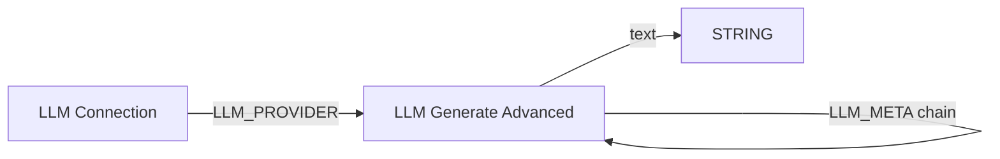

# Codebase Guide — comfyui-llm-bikeshed

Orientation map for developers and AI agents working on this ComfyUI custom node pack. Describes the repository as tracked in git (~**97 files** as of the current tree: **39** Python modules, **15** test files, **32** docs paths).

---

## Project purpose

**comfyui-llm-bikeshed** is a ComfyUI custom node pack for **LLM text generation** only — no image, video, music, or speech generation. The intended new graph is **LLM Connection** → **LLM Generate (Advanced)** (`LLMConnection`, `LLMGenerateAdvanced`). Provider, Lifecycle, Basic Generate, and Options nodes stay registered for existing workflows. They are not a second product path.

Supported backends (via a single OpenAI-compatible adapter path): **LM Studio**, **Textgen** (oobabooga text-generation-webui), **OpenAI Chat Completions**, and generic OAI-compatible hosts (including llama.cpp servers that expose `/v1/chat/completions`). **Native Ollama** (`/api/chat`) was removed in v0.3.0; fingerprinting may still label a host as Ollama on the OAI Compatible provider UI, but this pack does not ship Ollama nodes or adapters.

VRAM sharing with diffusion is a core requirement. On **LLM Connection**, one **Manage VRAM / Manage memory** toggle (`manage_model_memory`, default ON) gates it: Textgen uses explicit load/unload via internal HTTP when the toggle is ON; LM Studio uses TTL and optional `context_length` on load when the toggle is ON; OFF means the pack does not load, unload, or set TTL. OpenAI, generic hosts, and llama.cpp hide that toggle (llama.cpp router `/models/load` + `/models/unload` are not verified in detection or the adapter; chat still works). Legacy lifecycle nodes keep their own paths. API keys are resolved from `config.yaml` or environment variables at HTTP time — never stored in workflow JSON or node execution outputs.

**Current release:** v1.0.3 (`pyproject.toml`, `version.py`). That version line predates the unreleased Connection **Manage VRAM** toggle, Generate face `max_tokens`, and Properties interrupt unload — those are on `master` and are not a publish. Still not shipped: Q11 `model` / `loaded_model` sync, Options merge or delete, Q7 “refresh definitions instead of restart” auth UX, chat nodes, and extra cloud APIs. See [`WORKLIST.md`](WORKLIST.md).

---

## How ComfyUI loads this pack

ComfyUI discovers custom nodes by scanning `custom_nodes/` subdirectories. Each pack's root `__init__.py` must export:

| Export | Purpose |
|--------|---------|
| `NODE_CLASS_MAPPINGS` | Maps internal class names → node classes |
| `NODE_DISPLAY_NAME_MAPPINGS` | Maps internal names → UI display labels |
| `WEB_DIRECTORY` | Relative path to frontend JS (here: `"./js"`) |

**Entry point:** [`__init__.py`](__init__.py)

1. Imports all node classes from `nodes/`.
2. Imports `server.endpoints` as a side effect — registers PromptServer HTTP routes when ComfyUI's `server` module is available.
3. On `ImportError` (e.g. running unit tests outside ComfyUI), exports empty mappings so pytest can import submodules.

**Registered nodes (12):**

| Internal name | Display name | Module |
|---------------|--------------|--------|
| `LLMConnection` | LLM Connection | `nodes/providers.py` |
| `LLMProviderOAICompat` | LLM Provider: OAI Compatible | `nodes/providers.py` |
| `LLMProviderTextGenWebUI` | LLM Provider: Textgen | `nodes/providers.py` |
| `LLMLifecycleLMStudio` | LLM Lifecycle: LM Studio | `nodes/lifecycle.py` |
| `LLMLifecycleTextGenWebUI` | LLM Lifecycle: Textgen | `nodes/lifecycle.py` |
| `LLMGenerate` | LLM Generate (Basic) | `nodes/generation.py` |
| `LLMGenerateAdvanced` | LLM Generate (Advanced) | `nodes/generation.py` |
| `LLMOptionsLMStudio` | LLM Options: LM Studio | `nodes/options_lm_studio.py` |
| `LLMOptionsOpenAI` | LLM Options: OpenAI | `nodes/options_openai.py` |
| `LLMOptionsTextGenWebUI` | LLM Options: Textgen | `nodes/options_text_gen_webui.py` |
| `LLMPresetLoader` | LLM Preset Loader | `nodes/utils.py` |
| `LLMLoadTextFile` | LLM Load Text File | `nodes/utils.py` |

**Intended new-graph classes:** `LLMConnection` and `LLMGenerateAdvanced`. `LLMGenerate`, `LLMOptions*`, `LLMProvider*`, and `LLMLifecycle*` stay in the registry for compatibility. Do not unregister them from a docs pass.

**Custom socket types:** `LLM_PROVIDER`, `LLM_LIFECYCLE`, `LLM_OPTIONS`, `LLM_META` — plain Python dicts passed between nodes; no ComfyUI type registry beyond the string name. New graphs use `LLM_PROVIDER` and, when chaining, `LLM_META`. `LLM_OPTIONS` and `LLM_LIFECYCLE` are legacy sockets.

---

## Repository layout

```
comfyui-llm-bikeshed/
├── __init__.py                 # ComfyUI pack entry; node registry; WEB_DIRECTORY
├── version.py                  # __version__ (must match pyproject.toml)
├── detection.py                # Backend fingerprinting at a URL
├── model_list.py               # Model list HTTP helpers (server + tests)
│
├── adapters/                   # Backend HTTP adapters
│   ├── __init__.py             # get_adapter() registry
│   ├── base.py                 # LLMAdapter protocol, shared HTTP helpers
│   ├── oai_compat.py           # OpenAI-compatible generation + lifecycle hooks
│   └── interrupt.py            # ComfyUI Cancel during blocking requests
│
├── config/                     # YAML config load and credential resolution
│   ├── __init__.py             # load_config, get_api_key, get_textgen_auth_keys
│   ├── auth.py                 # resolve_provider_auth (HTTP-time secrets)
│   └── merge.py                # deep_merge for example + user config
│
├── graph/                      # Workflow introspection (P-10)
│   ├── __init__.py
│   └── introspection.py        # Downstream generation node detection
│
├── nodes/                      # ComfyUI node class definitions
│   ├── providers.py            # Connection + OAI Compatible + Textgen providers
│   ├── lifecycle.py            # LM Studio TTL + Textgen memory widgets
│   ├── generation.py           # Basic + Advanced; Advanced is the intended spine
│   ├── options_base.py         # Shared toggle-options builder
│   ├── options_lm_studio.py
│   ├── options_openai.py
│   ├── options_text_gen_webui.py
│   └── utils.py                # Preset loader + load text file
│
├── server/
│   └── endpoints.py            # PromptServer routes (models, detect)
│
├── js/
│   ├── model_dropdown.js       # Dynamic model COMBO + backend label UI
│   ├── llm_connection.js       # LLM Connection face / status / catalog rules
│   └── generate_properties.js  # Generate Properties: unload_on_interrupt
│
├── tests/                      # pytest suite (14 modules + conftest)
├── docs/                       # Design, research, reference, proposals
├── example_workflows/          # 5 workflow JSON templates (1 intended, 4 legacy)
├── presets/
│   ├── README.txt              # Format + how LLM Preset Loader lists files
│   └── llamacpp_oai_system.txt # Example system prompt (llama.cpp / OAI Compatible)
│
├── config.example.yaml         # Shipped defaults (merged with user config)
├── pyproject.toml              # Package metadata, dev deps, Comfy Registry ID
├── requirements.txt            # Mirrors pyproject runtime deps (pyyaml, requests)
├── README.md                   # User-facing install and node reference
├── CHANGELOG.md
├── CONTRIBUTING.md
├── LICENSE
├── AGENTS.md                   # Short tool-neutral pointer (not an agent control plane)
├── .gitignore
├── .comfyignore                # Excludes dev/docs from registry archive
└── .github/
    ├── ISSUE_TEMPLATE/bug_report.md
    └── workflows/
        ├── test.yml            # CI: ruff + pytest
        └── publish_registry.yml
```

---

## Core architecture

### Data flow (intended new graph)


```mermaid
flowchart LR
  C[LLM Connection] -->|LLM_PROVIDER| G[LLM Generate Advanced]
  G -->|text| T[STRING]
  G -->|LLM_META chain| G
```

No Options node and no Lifecycle node on that path. Connection embeds lifecycle in the provider dict only when **Manage VRAM** is ON for Textgen or LM Studio.

Legacy graphs that still load: Provider ± Lifecycle → Basic or Advanced, and Options → Advanced (`LLM_OPTIONS`). Those class IDs stay registered.

1. **Connection / Provider nodes** build an `LLM_PROVIDER` dict: `backend`, `adapter`, `url`, `model`, `timeout`, optional `lifecycle` (and Connection may set `load_before_generate`). **LLM Connection** is the new-graph node; legacy Provider nodes remain. Connection embeds lifecycle only when **Manage VRAM** is ON for Textgen or LM Studio.
2. **Lifecycle nodes** (legacy) output `LLM_LIFECYCLE` (LM Studio `ttl`/`context_length`, or Textgen `manage_model_memory`). They stay registered. Connection uses the same adapter hooks behind one toggle; LM Studio `ttl` / `context_length` show only on that face while Manage VRAM is ON.
3. **Options nodes** (legacy) output `LLM_OPTIONS` — only toggle-enabled parameters are included (`nodes/options_base.py`). The Advanced face `max_tokens` does not require this socket.
4. **Generation nodes** call `get_adapter(provider["adapter"]).generate(...)`, return `(text, meta)`. **LLM Generate (Advanced)** is the intended spine: optional provider / options / meta, with face `max_tokens` above `seed`. Basic stays registered (temperature + max_tokens + seed). `max_tokens` `0` omits the face cap; `>= 1` sends it (`max_completion_tokens` when `backend` is `openai`, otherwise `max_tokens`). Seed is always written from the widget, including `0`. Advanced accepts upstream `meta` for chaining; `graph.introspection.has_downstream_gen_node` sets `skip_unload` when another generation node is downstream on the `meta` output. Interrupt unload is **not** a face widget: LiteGraph property `unload_on_interrupt` (default off) is read from `extra_pnginfo.workflow.nodes[].properties`. It unloads on Cancel only when the provider dict has a lifecycle (Manage VRAM ON or a legacy lifecycle). Prompts without that workflow blob stay off.
5. **Caching / `IS_CHANGED` (deliberate):** Both `LLMGenerate` and `LLMGenerateAdvanced` implement `IS_CHANGED` as `return float("NaN")`. ComfyUI treats NaN fingerprints as never-equal, so generate nodes **always re-execute** on queue. That is intentional for LLM calls (non-deterministic / external HTTP); do not "fix" to a stable hash or seed fingerprint unless product explicitly wants cached skips. Standards note: `IS_CHANGED` is an equality fingerprint, not a boolean — `True` every time would incorrectly skip reruns.

### Adapters (`adapters/`)

| File | Role |
|------|------|
| [`adapters/__init__.py`](adapters/__init__.py) | Singleton registry; currently only `"oai_compat"` → `OAICompatAdapter` |
| [`adapters/base.py`](adapters/base.py) | `LLMAdapter` protocol; JSON sanitization; `_safe_get` / `_safe_post` wrappers |
| [`adapters/oai_compat.py`](adapters/oai_compat.py) | `POST {url}/v1/chat/completions`; per-backend parameter allowlists and name maps; `0` token limits omitted; OpenAI dedupes to `max_completion_tokens` when both fields are set (lone `max_tokens` kept); seed forwarded when set; LM Studio TTL; Textgen load/unload via `/v1/internal/model/*`; optional unload on ComfyUI interrupt when a lifecycle is present |
| [`adapters/interrupt.py`](adapters/interrupt.py) | Polls ComfyUI `processing_interrupted` during long HTTP calls |

Credentials are **not** embedded in provider dicts. Adapters call [`config.auth.resolve_provider_auth`](config/auth.py) at request time.

**Before changing Textgen HTTP paths or auth:** read [`docs/research/textgen-lifecycle-verified.md`](docs/research/textgen-lifecycle-verified.md).

### Backend detection (`detection.py`)

Probes URL paths in parallel to classify backends: `lm_studio`, `text_gen_webui`, `openai`, `llamacpp`, `ollama` (label only), `generic`. Used by OAI Compatible provider at build time and by `POST /llm-bikeshed/detect` for the frontend label.

`normalize_oai_base_url()` strips trailing `/v1` so appended paths do not become `/v1/v1/...`.

### Model lists (`model_list.py`)

Synchronous HTTP used from PromptServer via `asyncio.to_thread()`:

- **OAI path:** detect backend, try `/v1/models`, Textgen internal list fallback, auth retry on 401/403.
- **Textgen path:** prefer `GET /v1/internal/model/list`, then `/v1/models`; includes `loaded_model` from `/v1/internal/model/info`.

Connection-refused logging is debounced (WARNING once per 30s per URL).

### Server endpoints (`server/endpoints.py`)

Registered only when `aiohttp`, `PromptServer`, and relative imports succeed:

| Route | Method | Purpose |
|-------|--------|---------|
| `/llm-bikeshed/models/connection` | POST | Model list + status for **LLM Connection** (`url` + `host_mode`), including `manage_vram` |
| `/llm-bikeshed/models/oai-compat` | POST | Model list + backend label for legacy OAI Compatible node |
| `/llm-bikeshed/models/textgen` | POST | Textgen-only model list (no fingerprinting; legacy Textgen provider) |
| `/llm-bikeshed/detect` | POST | Backend detection for UI (legacy OAI Compatible label) |
| `/llm-bikeshed/models/ensure-loaded` | POST | Explicit load helper for generate / Manage VRAM (Textgen / LM Studio / llama.cpp when supported); **not** called on model pick (Vir Q6) |

Request body: JSON `{ "url": "<base URL>" }` (Connection also takes `host_mode`; ensure-loaded also takes `model` / `backend`).

**Not ComfyUI API-mode compatible:** These custom `/llm-bikeshed/*` routes are **client-server** helpers for the browser UI (model COMBO, backend label, status). `ensure-loaded` is an explicit-load helper for generate / Manage VRAM — not model-pick preload (Vir Q6). Official Comfy guidance: nodes that *require* direct client↔server traffic are **not** compatible with API/headless queue mode. **Graph dataflow remains the source of truth for generation** (`LLM_PROVIDER` → generate nodes → `POST {url}/v1/chat/completions`). Headless/API runners can still execute generation if provider URL/model are set in the workflow JSON; they will not get dynamic Refresh Models / detect / ensure-loaded from the JS extension.

### Frontend (`js/`)

ComfyUI extensions loaded via `WEB_DIRECTORY`. `llm_connection.js` and `model_dropdown.js` share debounce / read-only status patterns (Vir Q6: no model-pick ensure-loaded). `generate_properties.js` only adds the Generate Properties flag.

#### `js/llm_connection.js` (LLM Connection)

Extension name `llm-bikeshed.llm-connection`. Hooks **`LLMConnection`** only:

- Calls **`POST /llm-bikeshed/models/connection`** with `{ url, host_mode }` (debounced initial fetch ~600ms; URL / host_mode refetch ~500ms).
- **Refresh Models** button; read-only status chrome (serialize:false text widgets + DOM lock) for detected/effective backend, loaded model, auth hint — same Q1 pattern as `model_dropdown.js`.
- **Model widget rules (Q2):** one Python name `model` (COMBO). Catalog backends (Textgen / LM Studio / OpenAI) keep COMBO; llama.cpp / generic switch the same widget to free-text and restore COMBO when mode flips back.
- One **Manage VRAM** widget (`manage_model_memory`, label “Manage VRAM”). Shown when `manage_vram` is true (Textgen, LM Studio). Hidden for OpenAI, generic, and llama.cpp; the VRAM status line says why. `ttl` / `context_length` show only for LM Studio while the toggle is ON. **No model-pick preload** (Vir Q6): changing `model` never loads weights; load only on generate when Manage VRAM is ON.

#### `js/model_dropdown.js` (legacy providers)

Hooks **`LLMProviderOAICompat`** / **`LLMProviderTextGenWebUI`**:

- Debounced initial fetch (~600ms) to avoid duplicate requests when backends are offline.
- **Refresh Models** button repopulates the `model` COMBO widget via `/models/oai-compat` or `/models/textgen`.
- Textgen provider shows read-only **loaded** model line when the server returns `loaded_model`.
- Same read-only widget options and URL-refetch debounce constants as Connection (no ensure-loaded on model pick).

#### `js/generate_properties.js` (both Generate nodes)

Extension name `llm-bikeshed.generateProperties`. On `LLMGenerate` and `LLMGenerateAdvanced` node create, adds LiteGraph property `unload_on_interrupt` (label "Unload on interrupt", default false). Python reads it from `extra_pnginfo.workflow` at queue time. It is not a face widget.

### Configuration (`config/`)

Load order on first access:

1. Deep-merge [`config.example.yaml`](config.example.yaml) (defaults) + `config.yaml` (user overrides, **gitignored**).
2. Cache in module-global `_config`; `reload_config()` clears cache.

**API key resolution** (`get_api_key` / `get_admin_key`):

1. `providers.<name>.api_key` or `admin_key` in merged config
2. Environment: `LLM_BIKESHED_<PROVIDER>_API_KEY` or `LLM_BIKESHED_<PROVIDER>_ADMIN_KEY` (provider segment uppercased, e.g. `LLM_BIKESHED_LM_STUDIO_API_KEY`)
3. `None` for local backends without auth

**Textgen dual keys:** `get_textgen_auth_keys()` merges `text_gen_webui` and `oai_compat` slots; duplicates a single key to both api/admin when only one is set. See comments in `config.example.yaml` and the Textgen research note.

**Provider config keys in example YAML:**

| Key | Default URL | Notes |
|-----|-------------|-------|
| `providers.lm_studio` | `http://localhost:1234` | |
| `providers.openai` | `https://api.openai.com` | |
| `providers.text_gen_webui` | `http://localhost:5000` | `api_key` + `admin_key` |
| `providers.oai_compat` | (timeout only) | Fallback keys for OAI Compatible node |

Legacy `providers.ollama` in an existing user `config.yaml` is preserved by deep-merge but ignored by this pack.

### Graph introspection (`graph/introspection.py`)

Implements P-10 chain-aware unload deferral: walks the ComfyUI `PROMPT` dict to see if `meta` output connects to another `LLMGenerate` / `LLMGenerateAdvanced` node. Used by generation nodes to pass `skip_unload=True` to the adapter on non-terminal chain links.

---

## Testing

**Layout:** [`tests/`](tests/) — one module per major area; shared fixtures in [`tests/conftest.py`](tests/conftest.py) (adds repo root to `sys.path`, sample provider dicts, mock HTTP responses).

| Test module | Focus |
|-------------|-------|
| `test_adapters.py` | Adapter registry and generation plumbing |
| `test_oai_compat_openai.py` | OpenAI allowlist and payload shaping |
| `test_config.py` | Config merge and key resolution |
| `test_detection.py` | Backend fingerprinting |
| `test_endpoints.py` | PromptServer route handlers (mocked) |
| `test_generation.py` | Generation nodes; meta must not leak secrets |
| `test_graph.py` | Graph utilities |
| `test_graph_introspection.py` | Downstream node detection |
| `test_interrupt.py` | Cancel/interrupt during HTTP |
| `test_lifecycle.py` | Lifecycle node outputs |
| `test_model_list.py` | Model list HTTP helpers |
| `test_options.py` | Toggle options building |
| `test_providers.py` | Provider dict construction |
| `test_pack_no_ollama.py` | Ensures Ollama nodes/adapters are absent |

**Run locally:**

```bash
pip install -e ".[dev]"
python -m pytest -q          # or: python -m pytest tests/ -q
ruff check .
```

**CI:** [`.github/workflows/test.yml`](.github/workflows/test.yml) — Python 3.11, `ruff check .`, `pytest tests/ -q` on push/PR to `main` or `master`.

Tests import pack modules directly (not through ComfyUI's loader). `__init__.py` catches import errors so partial imports work outside ComfyUI.

---

## Documentation map

### Authoritative (use for decisions and implementation)

| Document | Purpose |
|----------|---------|
| [`docs/text_gen_processing_concept.md`](docs/text_gen_processing_concept.md) | Node architecture, categories, design rationale |
| [`docs/resolution_tracker.md`](docs/resolution_tracker.md) | Source of truth for open questions (A-*, P-*, API-*) |
| [`docs/research/textgen-lifecycle-verified.md`](docs/research/textgen-lifecycle-verified.md) | Verified Textgen HTTP/auth/routes |
| [`docs/research/lm-studio-lifecycle-verified.md`](docs/research/lm-studio-lifecycle-verified.md) | Verified LM Studio lifecycle behavior |
| [`docs/research/provenance-and-reverification.md`](docs/research/provenance-and-reverification.md) | Rules for citing external facts |
| [`docs/reference/comfyui-platform-findings.md`](docs/reference/comfyui-platform-findings.md) | ComfyUI platform behavior (P-9, P-10, COMBO) |
| [`docs/reference/implementation-patterns.md`](docs/reference/implementation-patterns.md) | Copy-paste node patterns |
| [`docs/reference/backend-api-parameters.md`](docs/reference/backend-api-parameters.md) | Per-backend parameter mapping |
| [`docs/lessons-learned.md`](docs/lessons-learned.md) | Post-incident notes (required after non-obvious fixes) |
| [`docs/VERSIONING.md`](docs/VERSIONING.md) | Semver, release checklist, registry |
| [`README.md`](README.md) | User install, nodes, quick start |
| [`CHANGELOG.md`](CHANGELOG.md) | Release history |

### Non-authoritative / roadmap signals

| Document | Purpose |
|----------|---------|
| [`docs/proposals/product-direction-and-scope.md`](docs/proposals/product-direction-and-scope.md) | Roadmap signals (Textgen-first, lifecycle rethink) |
| [`docs/proposals/textgen-rehaul.md`](docs/proposals/textgen-rehaul.md) | Textgen provider redesign notes |
| [`docs/proposals/textgen-rehaul-tasks.md`](docs/proposals/textgen-rehaul-tasks.md) | Task breakdown for Textgen rehaul |
| [`docs/proposals/ollama-removal-plan.md`](docs/proposals/ollama-removal-plan.md) | Historical removal plan (shipped 0.3.0) |
| [`docs/qol-backlog.md`](docs/qol-backlog.md) | Quality-of-life backlog |

### Research and handoffs (`docs/research/`)

| File | Topic |
|------|-------|
| `research-note-template.md` | Template for new verified research notes |
| `fresh-context-prevention-prompt.md` | Paste into new agent chats |
| `fresh-context-audit-prompt.md` | Audit-oriented fresh-context prompt |
| `cancel-interrupt-status.md` | Cancel/interrupt shipped vs gaps |
| `cancel-empirical-qa-handoff.md` | Human-run cancel QA protocol |
| `audit-handoff.md` | Audit handoff notes |
| `external-comfyui-reference-corpus.md` | Off-repo ComfyUI doc mirror pointer (DOC-1) |

### Archive and superseded

| Path | Notes |
|------|-------|
| [`docs/the-archive/`](docs/the-archive/) | Timestamped evidence captures; see [`docs/the-archive/README.md`](docs/the-archive/README.md) |
| `docs/old/` | **Superseded** concept docs — still tracked in git but listed in `.gitignore` for new files |
| [`docs/thorough-audit-2026-04-27.md`](docs/thorough-audit-2026-04-27.md) | Point-in-time audit snapshot |
| [`docs/design_review_update_2026-03-10.md`](docs/design_review_update_2026-03-10.md) | Design review update |

---

## Dependencies and packaging

### Runtime

Declared in **both** [`pyproject.toml`](pyproject.toml) `[project.dependencies]` and [`requirements.txt`](requirements.txt) (keep in sync):

- `pyyaml>=6.0`
- `requests>=2.28.0`

Registry / CNR installs read `pyproject.toml`. Git / Manager / `pip install -r requirements.txt` paths use the mirrored file so installs stay honest even when ComfyUI already ships overlapping packages.

```bash
pip install -r requirements.txt
# or: pip install -e .
```

**Explicitly excluded:** provider SDKs (`openai`, etc.), `torch`, `transformers`, `aiohttp` (ComfyUI provides aiohttp for PromptServer; pack does not depend on it directly). Pillow/numpy come from ComfyUI core when needed by the host — they are not pack runtime deps.

### Development

```bash
pip install -e ".[dev]"   # pytest>=7, ruff>=0.4
```

Or uv: `[dependency-groups].dev` mirrors optional `[project.optional-dependencies].dev`.

### Versioning

| File | Role |
|------|------|
| `pyproject.toml` `[project].version` | Canonical semver (Comfy Registry reads this) |
| `version.py` `__version__` | Runtime string; must match pyproject |

### ComfyUI Registry

- Publisher ID in `[tool.comfy]`: `amvir`
- Display name: **LLM Bikeshed**
- Publish workflow: [`.github/workflows/publish_registry.yml`](.github/workflows/publish_registry.yml) on `pyproject.toml` changes to `master`/`main`
- [`.comfyignore`](.comfyignore) strips dev-only paths from the registry archive (docs, tests, specs, `.github`, etc.)

---

## Example workflows and presets

| File | Description |
|------|-------------|
| [`example_workflows/connection_generate.json`](example_workflows/connection_generate.json) | **Intended:** Connection (Manage VRAM ON) → Advanced (`max_tokens` 1024 above `seed` 0; `unload_on_interrupt` off) |
| [`example_workflows/connection_basic.json`](example_workflows/connection_basic.json) | Legacy: Connection + Basic generate |
| [`example_workflows/basic_generation.json`](example_workflows/basic_generation.json) | Legacy: OAI Compatible provider + Basic |
| [`example_workflows/advanced_with_options.json`](example_workflows/advanced_with_options.json) | Legacy: OAI Compatible + Options + Advanced (face `max_tokens` / `seed` included) |
| [`example_workflows/textgen_basic.json`](example_workflows/textgen_basic.json) | Legacy: Textgen provider + Basic |

[`presets/`](presets/) — users add `.txt` files; **LLM Preset Loader** lists and reads them (skips `README.txt`). See [`presets/README.txt`](presets/README.txt). Shipped example: [`presets/llamacpp_oai_system.txt`](presets/llamacpp_oai_system.txt) for llama.cpp / OAI Compatible system prompts.

---

## What is NOT in the repo (gitignored / local-only)

These paths are excluded from normal git workflow or never committed:

| Pattern | Purpose |
|---------|---------|
| `config.yaml` | User secrets and host overrides |
| `.venv/`, `__pycache__/`, `*.egg-info/`, `dist/`, `build/` | Python build/env artifacts |
| `.pytest_cache/`, `.ruff_cache/`, `uv.lock` | Tool caches / lockfile (local uv use) |
| `docs/old/` (new files), `docs/blargh.md`, `docs/Screenshot-*.png` | Superseded or scratch docs |
| `specs/**` (local only) | Ignored local scratch under `specs/` — not project source of truth |
| `.claude/`, `*.code-workspace`, `.vscode/` | IDE/agent local config |
| `Thumbs.db`, `.DS_Store` | OS cruft |

**Note:** Root `CLAUDE.md` was removed in favor of `AGENTS.md`. `CLAUDE.md` remains in `.gitignore` so it is not re-added; `docs/old/*` may still appear in both `.gitignore` and history. This branch drops tracked `specs/` and `.claude/` from the index; ignore rules keep them local-only going forward.

**Not gitignored but excluded from Comfy Registry archive:** see [`.comfyignore`](.comfyignore) (`docs/`, `tests/`, `.github/`, `specs/`, `CONTRIBUTING.md`, `AGENTS.md`, `.claude/`).

---

## Conventions for contributors

1. **Scope:** LLM text generation only — see [`CONTRIBUTING.md`](CONTRIBUTING.md) and tracker before adding backends or node types.
2. **Imports:** Node and adapter modules use `try/except ImportError` with relative (`..`) and absolute fallbacks so code works both inside ComfyUI's custom-node loader and in pytest.
3. **Secrets:** Never put API keys in widgets, provider dicts, or `LLM_META` outputs. Use `config.auth.resolve_provider_auth` at HTTP time.
4. **Parameters:** Unsupported backend params are dropped with info-level logs, not user-facing errors.
5. **Node spec:** Target ComfyUI **V1** node API (`INPUT_TYPES`, `RETURN_TYPES`, `FUNCTION`, `CATEGORY`).
6. **Logging:** Logger name `llm-bikeshed` throughout.
7. **Quality gates:** `python -m pytest -q` and `ruff check .` before PRs.
8. **Changelog:** User-visible changes under `[Unreleased]` in [`CHANGELOG.md`](CHANGELOG.md).
9. **Lessons learned:** Non-obvious ComfyUI/backend quirks → [`docs/lessons-learned.md`](docs/lessons-learned.md).
10. **External claims:** Follow provenance gates in [`docs/research/provenance-and-reverification.md`](docs/research/provenance-and-reverification.md); use [`docs/research/research-note-template.md`](docs/research/research-note-template.md) for new verified notes.
11. **Branching:** PRs from branches off `master` (default branch per CHANGELOG 1.0.0).

---

## Quick reference: top-level Python modules

| Module | Lines of responsibility |
|--------|-------------------------|
| `__init__.py` | Node registration, WEB_DIRECTORY, server import side effect |
| `detection.py` | URL → backend type |
| `model_list.py` | Fetch model IDs and Textgen loaded model |
| `version.py` | Package version string |

[`AGENTS.md`](AGENTS.md) is only a short tool-neutral pointer to README / this file / `docs/`. It is not an agent control plane.
