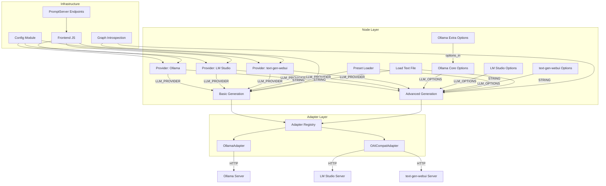
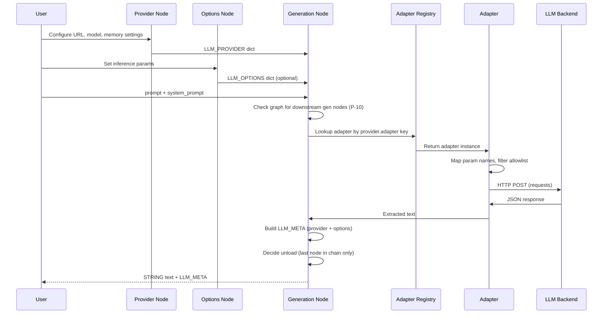
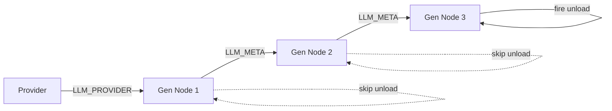

# Design: comfyui-llm-bikeshed

## Overview

ComfyUI custom node pack connecting workflows to local LLM backends (Ollama, LM Studio, text-generation-webui) via two adapters (Ollama Native, OpenAI-Compatible). Architecture uses Provider nodes to configure backends, Generation nodes to produce text, Options nodes for inference parameters, and a meta passthrough system for chaining. All HTTP is synchronous (`requests`), config is YAML with merge-on-load, and frontend JS handles dynamic model dropdowns.

## Architecture



## Data Flow



### Meta Chaining Flow



Gen nodes 1 and 2 detect downstream gen nodes via PROMPT reverse-indexing and defer unload. Gen node 3 is the last in the chain and fires unload/uses short keep_alive.

## Directory Structure

```
comfyui-llm-bikeshed/
├── __init__.py                    # NODE_CLASS_MAPPINGS, WEB_DIRECTORY
├── pyproject.toml                 # Registry metadata, dependencies
├── config.example.yaml            # Shipped defaults
├── config.yaml                    # User overrides (gitignored)
├── version.py                     # __version__ = "0.1.0"
├── CHANGELOG.md
├── README.md
├── LICENSE
├── .gitignore
│
├── nodes/
│   ├── __init__.py
│   ├── providers.py               # 3 Provider node classes
│   ├── generation.py              # Basic + Advanced generation nodes
│   ├── options_ollama.py          # Ollama Core + Extra Options
│   ├── options_lm_studio.py       # LM Studio Options
│   ├── options_text_gen_webui.py  # text-gen-webui Options
│   └── utils.py                   # Preset Loader + Load Text File
│
├── adapters/
│   ├── __init__.py                # Adapter registry
│   ├── base.py                    # Base adapter protocol
│   ├── ollama.py                  # Ollama Native adapter
│   └── oai_compat.py             # OpenAI-Compatible adapter
│
├── config/
│   ├── __init__.py                # load_config, get_config, get_api_key
│   └── merge.py                   # deep_merge utility
│
├── graph/
│   ├── __init__.py
│   └── introspection.py           # find_downstream_gen_nodes
│
├── server/
│   ├── __init__.py
│   └── endpoints.py               # PromptServer route handlers
│
├── js/
│   └── model_dropdown.js          # Frontend extension
│
├── presets/
│   └── README.txt                 # Placeholder for shipped presets
│
└── tests/
    ├── __init__.py
    ├── test_adapters.py
    ├── test_config.py
    ├── test_options.py
    ├── test_graph.py
    └── test_generation.py
```

## Components

### Custom Type Schemas

#### LLM_PROVIDER

```python
LLM_PROVIDER = {
    "backend": str,          # "ollama" | "lm_studio" | "text_gen_webui"
    "adapter": str,          # "ollama_native" | "oai_compat"
    "url": str,              # e.g. "http://localhost:11434"
    "model": str,            # model name (after fallback resolution)
    "timeout": int,          # HTTP timeout in seconds
    "api_key": str | None,   # resolved from config/env
    "admin_key": str | None, # text-gen-webui only
    "memory": {
        "keep_alive": str | None,  # Ollama: "30s"
        "ttl": int | None,         # LM Studio: 30
    },
}
```

#### LLM_OPTIONS

```python
LLM_OPTIONS = {
    # Only keys the user explicitly set (sentinel-excluded or toggle-enabled)
    # Examples:
    "temperature": 0.7,
    "max_tokens": 1024,
    "top_p": 0.9,
    # ... any subset of inference params
}
```

#### LLM_META

```python
LLM_META = {
    "provider": LLM_PROVIDER,  # full provider dict
    "options": LLM_OPTIONS,    # options used for this generation (may be empty dict)
}
```

---

### Provider Nodes

**File:** `nodes/providers.py`

Three classes: `LLMProviderOllama`, `LLMProviderLMStudio`, `LLMProviderTextGenWebUI`.

All share the same pattern. Differences: default URL, memory widget, backend/adapter keys.

```python
class LLMProviderOllama:
    CATEGORY = "LLM Bikeshed/providers"
    RETURN_TYPES = ("LLM_PROVIDER",)
    RETURN_NAMES = ("provider",)
    FUNCTION = "build_provider"

    @classmethod
    def INPUT_TYPES(cls):
        return {
            "required": {
                "url": ("STRING", {"default": "http://localhost:11434"}),
                "model": (["(refresh to load)"],),  # JS-populated COMBO
                "keep_alive": ("STRING", {"default": "30s"}),
            },
            "optional": {
                "model_fallback": ("STRING", {
                    "default": "",
                    "defaultInput": True,
                }),
            },
        }

    def build_provider(self, url: str, model: str,
                       keep_alive: str = "30s",
                       model_fallback: str = "") -> tuple:
        resolved_model = model_fallback.strip() if model_fallback.strip() else model
        config = get_config()
        provider = {
            "backend": "ollama",
            "adapter": "ollama_native",
            "url": url.rstrip("/"),
            "model": resolved_model,
            "timeout": config.get("providers", {}).get("ollama", {}).get("timeout", 120),
            "api_key": None,
            "admin_key": None,
            "memory": {"keep_alive": keep_alive, "ttl": None},
        }
        return (provider,)
```

**LM Studio variant:** `url` default `http://localhost:1234`, `ttl` INT widget (default 30, seconds), `adapter: "oai_compat"`, `backend: "lm_studio"`. API key from config/env.

**text-gen-webui variant:** `url` default `http://localhost:5000`, no memory widget (uses explicit unload), `adapter: "oai_compat"`, `backend: "text_gen_webui"`. Both `api_key` and `admin_key` resolved from config/env.

**Key behaviors:**
- No `IS_CHANGED` — ComfyUI default caching handles it (output only changes when widgets change)
- No API key widgets — keys resolved from config/env in `build_provider`
- `model_fallback` overrides COMBO when non-empty (FR-21)
- COMBO populated by frontend JS, not by `INPUT_TYPES`

---

### Generation Nodes

**File:** `nodes/generation.py`

Two classes: `LLMGenerate` (Basic), `LLMGenerateAdvanced`.

#### Basic Generation Node

```python
class LLMGenerate:
    CATEGORY = "LLM Bikeshed/generation"
    RETURN_TYPES = ("STRING", "LLM_META")
    RETURN_NAMES = ("text", "meta")
    FUNCTION = "generate"
    OUTPUT_NODE = False

    @classmethod
    def INPUT_TYPES(cls):
        return {
            "required": {
                "provider": ("LLM_PROVIDER",),
                "prompt": ("STRING", {"multiline": True}),
            },
            "optional": {
                "system_prompt": ("STRING", {"multiline": True, "default": ""}),
                "temperature": ("FLOAT", {"default": 0.7, "min": 0.0, "max": 2.0, "step": 0.05}),
                "max_tokens": ("INT", {"default": 1024, "min": 1, "max": 128000}),
                "seed": ("INT", {"default": -1, "min": -1, "max": 2**31 - 1}),
            },
            "hidden": {
                "prompt": "PROMPT",
                "unique_id": "UNIQUE_ID",
            },
        }

    @classmethod
    def IS_CHANGED(cls, **kwargs):
        return float("NaN")

    def generate(self, provider: dict, prompt: str,
                 system_prompt: str = "", temperature: float = 0.7,
                 max_tokens: int = 1024, seed: int = -1,
                 **kwargs) -> tuple:
        # 1. Build inline options (non-sentinel values only)
        options = {}
        if temperature >= 0:
            options["temperature"] = temperature
        if max_tokens > 0:
            options["max_tokens"] = max_tokens
        if seed >= 0:
            options["seed"] = seed

        # 2. Get adapter
        adapter = get_adapter(provider["adapter"])

        # 3. Check downstream for unload deferral
        graph_prompt = kwargs.get("prompt", {})
        unique_id = kwargs.get("unique_id", "")
        meta_output_index = 1  # meta is second output
        has_downstream = has_downstream_gen_node(
            graph_prompt, unique_id, meta_output_index
        )

        # 4. Generate
        text = adapter.generate(
            provider=provider,
            messages=_build_messages(system_prompt, prompt),
            options=options,
            skip_unload=has_downstream,
        )

        # 5. Build meta
        meta = {"provider": provider, "options": options}
        return (text, meta)
```

**Note on hidden input name collision:** The `prompt` hidden input and the `prompt` required STRING input share the same name. ComfyUI passes hidden inputs via `**kwargs`, so the hidden `prompt` (the PROMPT graph dict) comes through `kwargs["prompt"]` while the required `prompt` (user text) is a named parameter. This is the standard pattern used by many ComfyUI nodes.

#### Advanced Generation Node

```python
class LLMGenerateAdvanced:
    CATEGORY = "LLM Bikeshed/generation"
    RETURN_TYPES = ("STRING", "LLM_META")
    RETURN_NAMES = ("text", "meta")
    FUNCTION = "generate"

    @classmethod
    def INPUT_TYPES(cls):
        return {
            "required": {
                "prompt": ("STRING", {"multiline": True, "defaultInput": True}),
            },
            "optional": {
                "provider": ("LLM_PROVIDER",),
                "system_prompt": ("STRING", {"multiline": True, "default": "", "defaultInput": True}),
                "options": ("LLM_OPTIONS",),
                "meta": ("LLM_META",),
            },
            "hidden": {
                "prompt": "PROMPT",
                "unique_id": "UNIQUE_ID",
            },
        }

    @classmethod
    def IS_CHANGED(cls, **kwargs):
        return float("NaN")

    @classmethod
    def VALIDATE_INPUTS(cls, **kwargs):
        # Must have either provider or meta with provider
        # Actual validation happens at runtime since these are connection values
        return True

    def generate(self, prompt: str,
                 provider: dict = None, system_prompt: str = "",
                 options: dict = None, meta: dict = None,
                 **kwargs) -> tuple:
        # Meta precedence: explicit inputs win over meta values
        resolved_provider = provider or (meta.get("provider") if meta else None)
        if resolved_provider is None:
            raise ValueError("No provider configured. Connect a Provider node or a meta input.")

        resolved_options = options or (meta.get("options") if meta else None) or {}

        adapter = get_adapter(resolved_provider["adapter"])

        graph_prompt = kwargs.get("prompt", {})
        unique_id = kwargs.get("unique_id", "")
        has_downstream = has_downstream_gen_node(graph_prompt, unique_id, 1)

        text = adapter.generate(
            provider=resolved_provider,
            messages=_build_messages(system_prompt, prompt),
            options=resolved_options,
            skip_unload=has_downstream,
        )

        meta_out = {"provider": resolved_provider, "options": resolved_options}
        return (text, meta_out)
```

**Shared helper:**

```python
def _build_messages(system_prompt: str, prompt: str) -> list[dict]:
    messages = []
    if system_prompt:
        messages.append({"role": "system", "content": system_prompt})
    messages.append({"role": "user", "content": prompt})
    return messages
```

---

### Options Nodes

#### Ollama Core Options (`nodes/options_ollama.py`)

Sentinel-value pattern. No toggles. 7 params.

```python
class LLMOptionsOllamaCore:
    CATEGORY = "LLM Bikeshed/options"
    RETURN_TYPES = ("LLM_OPTIONS",)
    RETURN_NAMES = ("options",)
    FUNCTION = "build_options"

    SENTINELS = {
        "temperature": -1.0,
        "top_k": -1,
        "top_p": -1.0,
        "seed": -1,
        "num_predict": -1,
        "num_ctx": -1,
        "stop": "",
    }

    @classmethod
    def INPUT_TYPES(cls):
        return {
            "required": {
                "temperature": ("FLOAT", {"default": -1.0, "min": -1.0, "max": 2.0, "step": 0.05}),
                "top_k": ("INT", {"default": -1, "min": -1, "max": 500}),
                "top_p": ("FLOAT", {"default": -1.0, "min": -1.0, "max": 1.0, "step": 0.05}),
                "seed": ("INT", {"default": -1, "min": -1, "max": 2**31 - 1}),
                "num_predict": ("INT", {"default": -1, "min": -1, "max": 128000}),
                "num_ctx": ("INT", {"default": -1, "min": -1, "max": 131072}),
                "stop": ("STRING", {"default": ""}),
            },
            "optional": {
                "options_in": ("LLM_OPTIONS",),
            },
        }

    def build_options(self, options_in: dict = None, **kwargs) -> tuple:
        options = dict(options_in) if options_in else {}
        for param, sentinel in self.SENTINELS.items():
            value = kwargs.get(param)
            if value is not None and value != sentinel:
                options[param] = value
        return (options,)
```

#### Ollama Extra Options (`nodes/options_ollama.py`)

Toggle pattern. 10 params.

```python
class LLMOptionsOllamaExtra:
    CATEGORY = "LLM Bikeshed/options"
    RETURN_TYPES = ("LLM_OPTIONS",)
    RETURN_NAMES = ("options",)
    FUNCTION = "build_options"

    PARAMS = [
        ("mirostat", "INT", {"default": 0}),       # special: COMBO [0,1,2]
        ("mirostat_eta", "FLOAT", {"default": 0.1, "min": 0.0, "max": 1.0, "step": 0.01}),
        ("mirostat_tau", "FLOAT", {"default": 5.0, "min": 0.0, "max": 20.0, "step": 0.1}),
        ("repeat_penalty", "FLOAT", {"default": 1.1, "min": 0.0, "max": 5.0, "step": 0.05}),
        ("repeat_last_n", "INT", {"default": 64, "min": 0, "max": 2048}),
        ("frequency_penalty", "FLOAT", {"default": 0.0, "min": -2.0, "max": 2.0, "step": 0.05}),
        ("presence_penalty", "FLOAT", {"default": 0.0, "min": -2.0, "max": 2.0, "step": 0.05}),
        ("tfs_z", "FLOAT", {"default": 1.0, "min": 0.0, "max": 2.0, "step": 0.05}),
        ("typical_p", "FLOAT", {"default": 1.0, "min": 0.0, "max": 1.0, "step": 0.05}),
        ("min_p", "FLOAT", {"default": 0.0, "min": 0.0, "max": 1.0, "step": 0.05}),
    ]

    @classmethod
    def INPUT_TYPES(cls):
        inputs = {"required": {}, "optional": {"options_in": ("LLM_OPTIONS",)}}
        for name, dtype, opts in cls.PARAMS:
            if name == "mirostat":
                inputs["optional"][f"enable_{name}"] = ("BOOLEAN", {"default": False, "label_on": "ON", "label_off": "OFF"})
                inputs["optional"][name] = ([0, 1, 2], {"default": 0})
            else:
                inputs["optional"][f"enable_{name}"] = ("BOOLEAN", {"default": False, "label_on": "ON", "label_off": "OFF"})
                inputs["optional"][name] = (dtype, opts)
        return inputs

    def build_options(self, options_in: dict = None, **kwargs) -> tuple:
        options = dict(options_in) if options_in else {}
        for name, _, _ in self.PARAMS:
            if kwargs.get(f"enable_{name}", False):
                options[name] = kwargs[name]
        return (options,)
```

#### LM Studio Options (`nodes/options_lm_studio.py`)

Toggle pattern. 9 params: temperature, top_p, max_tokens, seed, stop, top_k, repeat_penalty, presence_penalty, frequency_penalty.

Same structure as Ollama Extra but with LM Studio's parameter set.

#### text-gen-webui Options (`nodes/options_text_gen_webui.py`)

Toggle pattern. 12 params: temperature, top_p, max_tokens, seed, stop, top_k, min_p, repeat_penalty, presence_penalty, frequency_penalty, typical_p, tfs.

Same structure. May split into Core/Extra post-implementation if too tall.

---

### Utility Nodes

**File:** `nodes/utils.py`

#### Preset Loader

```python
class LLMPresetLoader:
    CATEGORY = "LLM Bikeshed/utils"
    RETURN_TYPES = ("STRING",)
    RETURN_NAMES = ("text",)
    FUNCTION = "load_preset"

    @classmethod
    def INPUT_TYPES(cls):
        presets_dir = os.path.join(os.path.dirname(os.path.dirname(__file__)), "presets")
        files = [f for f in os.listdir(presets_dir) if f.endswith(".txt")] if os.path.isdir(presets_dir) else []
        if not files:
            files = ["(no presets found)"]
        return {
            "required": {
                "preset": (sorted(files),),
            },
        }

    def load_preset(self, preset: str) -> tuple:
        if preset == "(no presets found)":
            return ("",)
        path = os.path.join(os.path.dirname(os.path.dirname(__file__)), "presets", preset)
        with open(path, "r", encoding="utf-8") as f:
            return (f.read(),)
```

#### Load Text File

```python
class LLMLoadTextFile:
    CATEGORY = "LLM Bikeshed/utils"
    RETURN_TYPES = ("STRING",)
    RETURN_NAMES = ("text",)
    FUNCTION = "load_file"

    @classmethod
    def INPUT_TYPES(cls):
        input_dir = folder_paths.get_input_directory()  # ComfyUI's input folder
        files = [f for f in os.listdir(input_dir) if f.endswith(".txt")] if os.path.isdir(input_dir) else []
        if not files:
            files = ["(no .txt files found)"]
        return {
            "required": {
                "file": (sorted(files),),
            },
        }

    def load_file(self, file: str) -> tuple:
        if file == "(no .txt files found)":
            return ("",)
        path = os.path.join(folder_paths.get_input_directory(), file)
        with open(path, "r", encoding="utf-8") as f:
            return (f.read(),)
```

---

### Adapters

**File:** `adapters/base.py`

```python
from typing import Protocol

class LLMAdapter(Protocol):
    """Protocol for LLM backend adapters."""

    def generate(
        self,
        provider: dict,
        messages: list[dict],
        options: dict,
        skip_unload: bool = False,
    ) -> str:
        """Send generation request. Returns extracted text."""
        ...
```

#### Ollama Native Adapter (`adapters/ollama.py`)

```python
class OllamaAdapter:
    """Adapter for Ollama's native /api/chat endpoint."""

    # Params that go in the `options` object
    ALLOWED_OPTIONS = {
        "temperature", "top_k", "top_p", "min_p", "seed",
        "num_predict", "num_ctx", "stop",
        "repeat_penalty", "repeat_last_n", "presence_penalty",
        "frequency_penalty", "mirostat", "mirostat_eta", "mirostat_tau",
        "tfs_z", "typical_p",
    }

    # Name mapping: our canonical name -> Ollama name
    NAME_MAP = {
        "max_tokens": "num_predict",
    }

    def generate(self, provider: dict, messages: list[dict],
                 options: dict, skip_unload: bool = False) -> str:
        url = provider["url"]
        model = provider["model"]
        timeout = provider.get("timeout", 120)

        # Map and filter options
        ollama_options = {}
        for key, value in options.items():
            mapped_key = self.NAME_MAP.get(key, key)
            if mapped_key in self.ALLOWED_OPTIONS:
                ollama_options[mapped_key] = value
            else:
                logger.info(f"Parameter '{key}' not supported by Ollama, skipping")

        payload = {
            "model": model,
            "messages": messages,
            "stream": False,
            "options": ollama_options if ollama_options else None,
        }

        # Memory management
        if skip_unload:
            payload["keep_alive"] = "5m"  # longer TTL for mid-chain
        else:
            payload["keep_alive"] = provider.get("memory", {}).get("keep_alive", "30s")

        # Remove None values
        payload = {k: v for k, v in payload.items() if v is not None}

        response = requests.post(
            f"{url}/api/chat", json=payload, timeout=timeout
        )
        _raise_on_error(response, "Ollama", url)

        return response.json()["message"]["content"]
```

#### OpenAI-Compatible Adapter (`adapters/oai_compat.py`)

```python
class OAICompatAdapter:
    """Adapter for OpenAI-compatible endpoints (LM Studio, text-gen-webui)."""

    # Per-backend parameter allowlists
    BACKEND_ALLOWLISTS = {
        "lm_studio": {
            "temperature", "top_p", "max_tokens", "seed", "stop",
            "top_k", "repeat_penalty", "presence_penalty", "frequency_penalty",
        },
        "text_gen_webui": {
            "temperature", "top_p", "max_tokens", "seed", "stop",
            "top_k", "min_p", "repeat_penalty", "presence_penalty",
            "frequency_penalty", "typical_p", "tfs",
        },
    }

    # Name mapping per backend (our name -> backend name)
    NAME_MAPS = {
        "lm_studio": {},     # LM Studio uses standard OAI names
        "text_gen_webui": {
            "tfs_z": "tfs",  # Ollama's name -> text-gen-webui's name
        },
    }

    def generate(self, provider: dict, messages: list[dict],
                 options: dict, skip_unload: bool = False) -> str:
        backend = provider["backend"]
        url = provider["url"]
        model = provider["model"]
        timeout = provider.get("timeout", 120)
        allowlist = self.BACKEND_ALLOWLISTS.get(backend, set())
        name_map = self.NAME_MAPS.get(backend, {})

        # text-gen-webui: ensure model is loaded
        if backend == "text_gen_webui":
            self._ensure_model_loaded(provider, model)

        # Build payload
        payload = {
            "model": model,
            "messages": messages,
            "stream": False,
        }

        # Map and filter options
        for key, value in options.items():
            mapped_key = name_map.get(key, key)
            if mapped_key in allowlist:
                payload[mapped_key] = value
            else:
                logger.info(f"Parameter '{key}' not supported by {backend}, skipping")

        # LM Studio: TTL as top-level param
        if backend == "lm_studio":
            ttl = provider.get("memory", {}).get("ttl")
            if ttl is not None:
                if skip_unload:
                    payload["ttl"] = max(ttl, 300)  # at least 5min mid-chain
                else:
                    payload["ttl"] = ttl

        # Auth header
        headers = {}
        api_key = provider.get("api_key")
        if api_key:
            headers["Authorization"] = f"Bearer {api_key}"

        response = requests.post(
            f"{url}/v1/chat/completions",
            json=payload, headers=headers, timeout=timeout
        )
        _raise_on_error(response, backend, url)

        text = response.json()["choices"][0]["message"]["content"]

        # text-gen-webui: unload if last in chain
        if backend == "text_gen_webui" and not skip_unload:
            self._unload_model(provider)

        return text

    def _ensure_model_loaded(self, provider: dict, model: str) -> None:
        """Check if correct model is loaded, load if needed."""
        url = provider["url"]
        headers = self._admin_headers(provider)
        timeout = provider.get("timeout", 120)

        try:
            info = requests.get(
                f"{url}/v1/internal/model/info",
                headers=headers, timeout=30
            )
            info.raise_for_status()
            current = info.json().get("model_name", "")
            if current == model:
                return  # Already loaded
        except requests.RequestException:
            pass  # Proceed to load attempt

        logger.info(f"Loading model '{model}' on text-gen-webui...")
        load_resp = requests.post(
            f"{url}/v1/internal/model/load",
            json={"model_name": model},
            headers=headers, timeout=timeout
        )
        _raise_on_error(load_resp, "text_gen_webui", url)

    def _unload_model(self, provider: dict) -> None:
        """Unload current model from text-gen-webui."""
        url = provider["url"]
        headers = self._admin_headers(provider)
        try:
            requests.post(
                f"{url}/v1/internal/model/unload",
                headers=headers, timeout=30
            )
        except requests.RequestException as e:
            logger.warning(f"Failed to unload model: {e}")

    def _admin_headers(self, provider: dict) -> dict:
        """Build headers with admin key (falls back to api_key)."""
        key = provider.get("admin_key") or provider.get("api_key")
        if key:
            return {"Authorization": f"Bearer {key}"}
        return {}
```

#### Shared error helper

```python
def _raise_on_error(response: requests.Response, backend: str, url: str) -> None:
    """Raise descriptive exception on HTTP error."""
    if not response.ok:
        try:
            body = response.text[:500]
        except Exception:
            body = "(could not read response body)"
        raise RuntimeError(
            f"[llm-bikeshed] {backend} error at {url}: "
            f"HTTP {response.status_code} — {body}"
        )
```

#### Adapter Registry (`adapters/__init__.py`)

```python
from .ollama import OllamaAdapter
from .oai_compat import OAICompatAdapter

_ADAPTERS = {
    "ollama_native": OllamaAdapter(),
    "oai_compat": OAICompatAdapter(),
}

def get_adapter(adapter_type: str):
    """Look up adapter instance by type key from provider dict."""
    adapter = _ADAPTERS.get(adapter_type)
    if adapter is None:
        raise ValueError(f"Unknown adapter type: {adapter_type}")
    return adapter
```

---

### Config Module

**File:** `config/__init__.py`

```python
import copy
import os
import yaml
import logging
from .merge import deep_merge

logger = logging.getLogger("llm-bikeshed")

_config: dict | None = None
_pack_dir = os.path.dirname(os.path.dirname(__file__))

def load_config() -> dict:
    """Load and cache config: deep-merge example + user."""
    global _config
    example_path = os.path.join(_pack_dir, "config.example.yaml")
    user_path = os.path.join(_pack_dir, "config.yaml")

    defaults = _load_yaml(example_path) or {}
    user = _load_yaml(user_path) or {}

    _config = deep_merge(defaults, user)
    return _config

def get_config() -> dict:
    global _config
    if _config is None:
        load_config()
    return _config

def get_api_key(provider: str) -> str | None:
    """config.yaml -> env var -> None"""
    cfg = get_config()
    key = cfg.get("providers", {}).get(provider, {}).get("api_key")
    if key:
        return key
    return os.environ.get(f"LLM_BIKESHED_{provider.upper()}_API_KEY")

def get_admin_key(provider: str) -> str | None:
    """For text-gen-webui: admin_key -> api_key -> env var -> None"""
    cfg = get_config()
    prov_cfg = cfg.get("providers", {}).get(provider, {})
    key = prov_cfg.get("admin_key") or prov_cfg.get("api_key")
    if key:
        return key
    return os.environ.get(f"LLM_BIKESHED_{provider.upper()}_ADMIN_KEY")

def _load_yaml(path: str) -> dict | None:
    if not os.path.exists(path):
        return None
    with open(path, "r", encoding="utf-8") as f:
        return yaml.safe_load(f)
```

**File:** `config/merge.py`

```python
import copy

def deep_merge(base: dict, override: dict) -> dict:
    """Deep-merge override into base. Override values win."""
    result = copy.deepcopy(base)
    for key, value in override.items():
        if key in result and isinstance(result[key], dict) and isinstance(value, dict):
            result[key] = deep_merge(result[key], value)
        else:
            result[key] = copy.deepcopy(value)
    return result
```

#### config.example.yaml structure

```yaml
providers:
  ollama:
    url: "http://localhost:11434"
    timeout: 120

  lm_studio:
    url: "http://localhost:1234"
    timeout: 120
    # api_key: ""  # Uncomment if LM Studio auth is enabled

  text_gen_webui:
    url: "http://localhost:5000"
    timeout: 120
    # api_key: ""    # For generation endpoints
    # admin_key: ""  # For model management (load/unload/list)
```

---

### Graph Introspection

**File:** `graph/introspection.py`

```python
# Generation node class types for downstream detection
GENERATION_CLASS_TYPES = {"LLMGenerate", "LLMGenerateAdvanced"}

def find_downstream_nodes(prompt: dict, node_id: str, output_index: int = 0) -> list[tuple]:
    """Find nodes whose inputs connect to node_id's output_index.

    Returns list of (node_id, class_type, input_name).
    """
    downstream = []
    for nid, node_def in prompt.items():
        for input_name, input_val in node_def.get("inputs", {}).items():
            if isinstance(input_val, list) and len(input_val) == 2:
                if str(input_val[0]) == str(node_id) and input_val[1] == output_index:
                    downstream.append((nid, node_def.get("class_type", ""), input_name))
    return downstream

def has_downstream_gen_node(prompt: dict, node_id: str, meta_output_index: int) -> bool:
    """Check if any downstream node on meta output is a generation node."""
    downstream = find_downstream_nodes(prompt, node_id, meta_output_index)
    return any(ct in GENERATION_CLASS_TYPES for _, ct, _ in downstream)
```

---

### PromptServer Endpoints

**File:** `server/endpoints.py`

```python
from aiohttp import web
from server import PromptServer
import asyncio
import requests
import logging
from ..config import get_config, get_api_key, get_admin_key, load_config

logger = logging.getLogger("llm-bikeshed")

def _fetch_models_ollama(url: str, timeout: int = 10) -> list[str]:
    resp = requests.get(f"{url}/api/tags", timeout=timeout)
    resp.raise_for_status()
    return [m["name"] for m in resp.json().get("models", [])]

def _fetch_models_lm_studio(url: str, api_key: str | None = None,
                             timeout: int = 10) -> list[str]:
    headers = {"Authorization": f"Bearer {api_key}"} if api_key else {}
    resp = requests.get(f"{url}/v1/models", headers=headers, timeout=timeout)
    resp.raise_for_status()
    return [m["id"] for m in resp.json().get("data", [])]

def _fetch_models_text_gen_webui(url: str, admin_key: str | None = None,
                                  timeout: int = 10) -> list[str]:
    headers = {"Authorization": f"Bearer {admin_key}"} if admin_key else {}
    resp = requests.get(f"{url}/v1/internal/model/list",
                        headers=headers, timeout=timeout)
    resp.raise_for_status()
    return resp.json().get("model_names", [])

@PromptServer.instance.routes.post("/llm-bikeshed/models/ollama")
async def get_ollama_models(request):
    data = await request.json()
    url = data.get("url", "http://localhost:11434")
    try:
        models = await asyncio.to_thread(_fetch_models_ollama, url)
        return web.json_response({"models": models})
    except Exception as e:
        logger.info(f"Could not fetch Ollama models from {url}: {e}")
        return web.json_response({"models": []})

@PromptServer.instance.routes.post("/llm-bikeshed/models/lm-studio")
async def get_lm_studio_models(request):
    data = await request.json()
    url = data.get("url", "http://localhost:1234")
    api_key = get_api_key("lm_studio")
    try:
        # Try without auth first
        models = await asyncio.to_thread(_fetch_models_lm_studio, url, None)
        return web.json_response({"models": models})
    except requests.HTTPError as e:
        if e.response and e.response.status_code in (401, 403) and api_key:
            try:
                models = await asyncio.to_thread(
                    _fetch_models_lm_studio, url, api_key
                )
                return web.json_response({"models": models})
            except Exception:
                pass
        logger.info(f"Could not fetch LM Studio models from {url}: {e}")
        return web.json_response({"models": []})
    except Exception as e:
        logger.info(f"Could not fetch LM Studio models from {url}: {e}")
        return web.json_response({"models": []})

@PromptServer.instance.routes.post("/llm-bikeshed/models/text-gen-webui")
async def get_text_gen_webui_models(request):
    data = await request.json()
    url = data.get("url", "http://localhost:5000")
    admin_key = get_admin_key("text_gen_webui")
    try:
        # Try without auth first
        models = await asyncio.to_thread(
            _fetch_models_text_gen_webui, url, None
        )
        return web.json_response({"models": models})
    except requests.HTTPError as e:
        if e.response and e.response.status_code in (401, 403) and admin_key:
            try:
                models = await asyncio.to_thread(
                    _fetch_models_text_gen_webui, url, admin_key
                )
                return web.json_response({"models": models})
            except Exception:
                pass
        logger.info(f"Could not fetch text-gen-webui models from {url}: {e}")
        return web.json_response({"models": []})
    except Exception as e:
        logger.info(f"Could not fetch text-gen-webui models from {url}: {e}")
        return web.json_response({"models": []})

@PromptServer.instance.routes.post("/llm-bikeshed/reload-config")
async def reload_config(request):
    load_config()
    logger.info("Config reloaded")
    return web.json_response({"status": "ok"})
```

---

### Frontend JS

**File:** `js/model_dropdown.js`

```javascript
import { app } from "../../scripts/app.js";

const PROVIDER_CONFIG = {
    LLMProviderOllama: {
        endpoint: "/llm-bikeshed/models/ollama",
        defaultUrl: "http://localhost:11434",
    },
    LLMProviderLMStudio: {
        endpoint: "/llm-bikeshed/models/lm-studio",
        defaultUrl: "http://localhost:1234",
    },
    LLMProviderTextGenWebUI: {
        endpoint: "/llm-bikeshed/models/text-gen-webui",
        defaultUrl: "http://localhost:5000",
    },
};

async function fetchModels(endpoint, url) {
    try {
        const resp = await fetch(endpoint, {
            method: "POST",
            headers: { "Content-Type": "application/json" },
            body: JSON.stringify({ url }),
        });
        const data = await resp.json();
        return data.models || [];
    } catch (e) {
        console.warn("[llm-bikeshed] Failed to fetch models:", e);
        return [];
    }
}

app.registerExtension({
    name: "llm-bikeshed.model-dropdown",

    async nodeCreated(node) {
        const config = PROVIDER_CONFIG[node.comfyClass];
        if (!config) return;

        const modelWidget = node.widgets.find((w) => w.name === "model");
        const urlWidget = node.widgets.find((w) => w.name === "url");
        if (!modelWidget) return;

        // Store original saved value
        const savedModel = modelWidget.value;

        // Fetch and populate models
        async function refreshModels() {
            const url = urlWidget ? urlWidget.value : config.defaultUrl;
            const models = await fetchModels(config.endpoint, url);
            if (models.length > 0) {
                modelWidget.options.values = models;
                // Restore saved value if it exists in the new list
                if (models.includes(savedModel)) {
                    modelWidget.value = savedModel;
                }
            } else {
                // Keep current value but show it's from cache
                if (!modelWidget.options.values.length ||
                    modelWidget.options.values[0] === "(refresh to load)") {
                    modelWidget.options.values = ["(backend offline)"];
                }
            }
            app.graph.setDirtyCanvas(true);
        }

        // Add refresh button
        node.addWidget("button", "refresh_models", null, refreshModels);

        // Initial fetch
        await refreshModels();
    },
});
```

---

### Node Registration (`__init__.py`)

```python
from .nodes.providers import LLMProviderOllama, LLMProviderLMStudio, LLMProviderTextGenWebUI
from .nodes.generation import LLMGenerate, LLMGenerateAdvanced
from .nodes.options_ollama import LLMOptionsOllamaCore, LLMOptionsOllamaExtra
from .nodes.options_lm_studio import LLMOptionsLMStudio
from .nodes.options_text_gen_webui import LLMOptionsTextGenWebUI
from .nodes.utils import LLMPresetLoader, LLMLoadTextFile

# Import server endpoints (registration happens at import)
from . import server  # noqa: F401

NODE_CLASS_MAPPINGS = {
    "LLMProviderOllama": LLMProviderOllama,
    "LLMProviderLMStudio": LLMProviderLMStudio,
    "LLMProviderTextGenWebUI": LLMProviderTextGenWebUI,
    "LLMGenerate": LLMGenerate,
    "LLMGenerateAdvanced": LLMGenerateAdvanced,
    "LLMOptionsOllamaCore": LLMOptionsOllamaCore,
    "LLMOptionsOllamaExtra": LLMOptionsOllamaExtra,
    "LLMOptionsLMStudio": LLMOptionsLMStudio,
    "LLMOptionsTextGenWebUI": LLMOptionsTextGenWebUI,
    "LLMPresetLoader": LLMPresetLoader,
    "LLMLoadTextFile": LLMLoadTextFile,
}

NODE_DISPLAY_NAME_MAPPINGS = {
    "LLMProviderOllama": "LLM Provider: Ollama",
    "LLMProviderLMStudio": "LLM Provider: LM Studio",
    "LLMProviderTextGenWebUI": "LLM Provider: text-gen-webui",
    "LLMGenerate": "LLM Generate (Basic)",
    "LLMGenerateAdvanced": "LLM Generate (Advanced)",
    "LLMOptionsOllamaCore": "LLM Options: Ollama (Core)",
    "LLMOptionsOllamaExtra": "LLM Options: Ollama (Extra)",
    "LLMOptionsLMStudio": "LLM Options: LM Studio",
    "LLMOptionsTextGenWebUI": "LLM Options: text-gen-webui",
    "LLMPresetLoader": "LLM Preset Loader",
    "LLMLoadTextFile": "LLM Load Text File",
}

WEB_DIRECTORY = "./js"
__all__ = ["NODE_CLASS_MAPPINGS", "NODE_DISPLAY_NAME_MAPPINGS", "WEB_DIRECTORY"]
```

---

## Technical Decisions

| Decision | Options Considered | Choice | Rationale |
|----------|-------------------|--------|-----------|
| Adapter instances | Per-call instantiation, singleton registry | Singleton registry | Adapters are stateless. One instance each, looked up by key. Simple. |
| Options chaining | Deep merge in generation node, chain at options level | Chain at options level via `options_in` | Keeps generation node simple. Options nodes handle their own merge. Downstream wins on key collision. |
| PromptServer endpoint structure | Single endpoint with `backend_type` param, per-backend endpoints | Per-backend endpoints | Clearer URL routing, easier to test independently, each handler is simpler. |
| Provider `model` widget | COMBO via INPUT_TYPES, COMBO via JS | COMBO via JS | INPUT_TYPES runs at import time when backend may be offline. JS can show fallback states, persist saved values, add refresh button. |
| Hidden input collision | Rename hidden `prompt` to `graph_prompt`, keep standard name | Keep standard name `prompt` | ComfyUI convention. Hidden inputs come through `**kwargs`, required inputs are named parameters. No actual collision. |
| Options node sentinel vs toggle | All toggles, all sentinels, hybrid | Hybrid (Ollama Core: sentinels, everything else: toggles) | Sentinels are compact for common params (7 widgets vs 14). Toggles are explicit for advanced/optional params where defaults aren't obvious. |
| Config reload | Per-execution, on-demand endpoint | On-demand endpoint | Config changes are rare during a session. Per-execution is unnecessary overhead. |
| `folder_paths` import for Load Text File | Hardcode `input/` path, use ComfyUI's `folder_paths` | Use `folder_paths` | ComfyUI provides `folder_paths.get_input_directory()` — portable, respects custom installs. |

## Error Handling Strategy

| Component | Error Type | Handling | User Impact |
|-----------|-----------|----------|-------------|
| **Adapters** | HTTP error (4xx/5xx) | `_raise_on_error()` — RuntimeError with backend name, URL, status, body | Workflow halts, red outline on generation node |
| **Adapters** | Network timeout | `requests.Timeout` propagates as exception | Workflow halts with timeout message |
| **Adapters** | Unsupported param | `logger.info()` — param dropped silently | Generation proceeds, visible in console |
| **Generation nodes** | No provider configured | `ValueError` raised | Workflow halts with clear message |
| **Generation nodes** | Pre-execution checks | `VALIDATE_INPUTS` — URL format, provider presence | Prevents execution with known-bad config |
| **PromptServer** | Backend offline | Return `{"models": []}`, log info | COMBO shows fallback, user can type model manually |
| **PromptServer** | Auth failure (401/403) | Try without auth first, retry with key if available, log info | Empty model list if both fail |
| **Config** | Missing config.yaml | Use defaults from config.example.yaml | Fully functional with defaults |
| **Config** | Invalid YAML | `yaml.safe_load()` raises `yaml.YAMLError` | Error at module load, visible in console |
| **text-gen-webui adapter** | Model load failure | RuntimeError with details | Workflow halts before generation attempt |
| **text-gen-webui adapter** | Unload failure | `logger.warning()`, exception swallowed | Non-fatal — VRAM may not be freed but generation succeeded |
| **Utility nodes** | File not found | Read error propagates | Workflow halts |

## Edge Cases

- **Empty model_fallback:** Whitespace-only or empty string is treated as "not set" — COMBO value is used
- **Options chaining with no overlap:** Extra → Core merges cleanly. Core values always win for any collision (though param sets are disjoint by design)
- **Meta without provider:** Advanced node raises ValueError if neither explicit provider nor meta provides one
- **Meta options + explicit options:** Explicit `options` input completely replaces meta's options (not merged)
- **Backend offline at node creation:** JS shows "(backend offline)" in COMBO. Saved model name from workflow persists in widgets_values
- **Config reload during execution:** Config is read once at generation time. Mid-execution reload doesn't affect running workflow
- **text-gen-webui model already loaded:** `_ensure_model_loaded` checks first, skips load if correct model is already active
- **Multiple text-gen-webui gen nodes in chain:** Only the last one fires unload. Mid-chain nodes detect downstream gen nodes and skip
- **Seed -1 on Basic node:** Treated as sentinel — excluded from options. Model uses its own random seed

## Test Strategy

### Unit Tests

**`tests/test_adapters.py`**
- OllamaAdapter: name mapping (`max_tokens` -> `num_predict`), allowlist filtering (unknown param dropped), payload structure (`options` nested), `keep_alive` placement (top-level), mid-chain vs last-node keep_alive values
- OAICompatAdapter: per-backend allowlist filtering, auth headers, text-gen-webui lifecycle calls (mock check/load/generate/unload sequence), TTL handling for LM Studio
- Shared: `_raise_on_error` with various status codes and bodies

**`tests/test_config.py`**
- `deep_merge`: nested override, new keys added, user values win, base values preserved
- `load_config`: example-only, user-only, both present, missing files
- `get_api_key`: from config, from env var, fallback to None
- `get_admin_key`: admin_key present, fallback to api_key, env var, None

**`tests/test_options.py`**
- Ollama Core: sentinel exclusion (value == -1 -> not in output), non-sentinel inclusion, options_in chaining
- Ollama Extra: toggle off -> excluded, toggle on -> included, options_in chaining
- LM Studio: toggle behavior
- text-gen-webui: toggle behavior

**`tests/test_graph.py`**
- `find_downstream_nodes`: node with connections, node with no connections, multiple downstream nodes
- `has_downstream_gen_node`: mid-chain (returns True), last node (returns False), non-gen downstream (returns False)

**`tests/test_generation.py`**
- `_build_messages`: with system prompt, without system prompt
- Basic generation: inline option building from widget values, sentinel exclusion
- Advanced generation: meta precedence (explicit provider wins, explicit options wins), no provider error

### Mock Strategy

- `unittest.mock.patch("requests.post")` and `patch("requests.get")` for all HTTP calls
- Mock `PromptServer.instance` for endpoint registration tests (or skip — registration is side-effect at import)
- Use fixture dicts for PROMPT graph data in introspection tests
- `monkeypatch` for environment variables in config tests

### Test File Organization

All tests under `tests/`. Run with `pytest tests/` from project root.

## File Manifest

### Root

| File | Action | Purpose |
|------|--------|---------|
| `__init__.py` | Create | Node registration, WEB_DIRECTORY |
| `pyproject.toml` | Create | Package metadata, dependencies |
| `config.example.yaml` | Create | Shipped config defaults |
| `version.py` | Create | `__version__ = "0.1.0"` |
| `CHANGELOG.md` | Create | Keep-a-changelog format |
| `.gitignore` | Modify | Add `config.yaml` |

### `nodes/`

| File | Action | Purpose |
|------|--------|---------|
| `nodes/__init__.py` | Create | Package init |
| `nodes/providers.py` | Create | 3 Provider node classes |
| `nodes/generation.py` | Create | Basic + Advanced generation nodes |
| `nodes/options_ollama.py` | Create | Ollama Core (sentinel) + Extra (toggle) Options |
| `nodes/options_lm_studio.py` | Create | LM Studio Options (toggle) |
| `nodes/options_text_gen_webui.py` | Create | text-gen-webui Options (toggle) |
| `nodes/utils.py` | Create | Preset Loader + Load Text File |

### `adapters/`

| File | Action | Purpose |
|------|--------|---------|
| `adapters/__init__.py` | Create | Adapter registry (`get_adapter`) |
| `adapters/base.py` | Create | `LLMAdapter` protocol |
| `adapters/ollama.py` | Create | Ollama Native adapter |
| `adapters/oai_compat.py` | Create | OpenAI-Compatible adapter |

### `config/`

| File | Action | Purpose |
|------|--------|---------|
| `config/__init__.py` | Create | Config loading, API key resolution |
| `config/merge.py` | Create | `deep_merge` utility |

### `graph/`

| File | Action | Purpose |
|------|--------|---------|
| `graph/__init__.py` | Create | Package init |
| `graph/introspection.py` | Create | Graph topology analysis functions |

### `server/`

| File | Action | Purpose |
|------|--------|---------|
| `server/__init__.py` | Create | Import endpoints for registration |
| `server/endpoints.py` | Create | PromptServer route handlers (4 endpoints) |

### `js/`

| File | Action | Purpose |
|------|--------|---------|
| `js/model_dropdown.js` | Create | Frontend extension for model dropdowns + refresh |

### `presets/`

| File | Action | Purpose |
|------|--------|---------|
| `presets/README.txt` | Create | Placeholder explaining preset directory purpose |

### `tests/`

| File | Action | Purpose |
|------|--------|---------|
| `tests/__init__.py` | Create | Package init |
| `tests/test_adapters.py` | Create | Adapter unit tests |
| `tests/test_config.py` | Create | Config + merge unit tests |
| `tests/test_options.py` | Create | Options builder unit tests |
| `tests/test_graph.py` | Create | Graph introspection unit tests |
| `tests/test_generation.py` | Create | Generation logic unit tests |

## Performance Considerations

- HTTP timeout default 120s, configurable per-provider. Prevents hanging on unresponsive backends.
- Config cached at module load. Reload only on explicit endpoint call.
- `stream: false` — entire response buffered. Acceptable for text generation (typical responses < 10KB).
- No retry logic — fail fast. Retries would delay VRAM reclamation and confuse error reporting.
- Adapter instances are singletons — zero allocation overhead per generation call.

## Security Considerations

- API keys never on node widgets — never serialized to workflow JSON (FR: AC-4.1 through AC-4.3)
- `yaml.safe_load()` only — no arbitrary code execution from config files
- No `eval()`, `exec()`, or `subprocess` anywhere
- Admin key for text-gen-webui stored in config.yaml (gitignored) or env var only
- PromptServer endpoints attempt requests without auth first, only include keys if configured

## Existing Patterns to Follow

- ComfyUI V1 node spec: `INPUT_TYPES` classmethod, `RETURN_TYPES` tuple, `FUNCTION` string, `CATEGORY` string
- `RETURN_TYPES` trailing comma for single outputs: `("STRING",)`
- Hidden inputs: `"hidden": {"prompt": "PROMPT", "unique_id": "UNIQUE_ID"}`
- COMBO via list in INPUT_TYPES: `(["opt1", "opt2"],)`
- BOOLEAN with labels: `("BOOLEAN", {"default": False, "label_on": "ON", "label_off": "OFF"})`
- `WEB_DIRECTORY = "./js"` in `__init__.py`
- JS extension: `app.registerExtension({name: "...", async nodeCreated(node) {...}})`
- PromptServer: `@PromptServer.instance.routes.post("/path")` with `async def handler(request)`

## Implementation Steps

1. Scaffold project: `__init__.py`, `pyproject.toml`, `version.py`, `.gitignore`, `config.example.yaml`, `presets/README.txt`
2. Implement config module: `config/merge.py`, `config/__init__.py`
3. Implement graph introspection: `graph/introspection.py`
4. Implement adapter base + registry: `adapters/base.py`, `adapters/__init__.py`
5. Implement OAI-Compatible adapter: `adapters/oai_compat.py` (serves LM Studio and text-gen-webui)
6. Implement Ollama Native adapter: `adapters/ollama.py`
7. Implement Provider nodes: `nodes/providers.py` (all 3)
8. Implement Generation nodes: `nodes/generation.py` (Basic + Advanced)
9. Implement Options nodes: `nodes/options_ollama.py`, `nodes/options_lm_studio.py`, `nodes/options_text_gen_webui.py`
10. Implement Utility nodes: `nodes/utils.py` (Preset Loader + Load Text File)
11. Implement PromptServer endpoints: `server/endpoints.py`
12. Implement Frontend JS: `js/model_dropdown.js`
13. Wire up `__init__.py` with NODE_CLASS_MAPPINGS
14. Write tests: adapters, config, options, graph, generation
15. Manual integration testing with running backends
